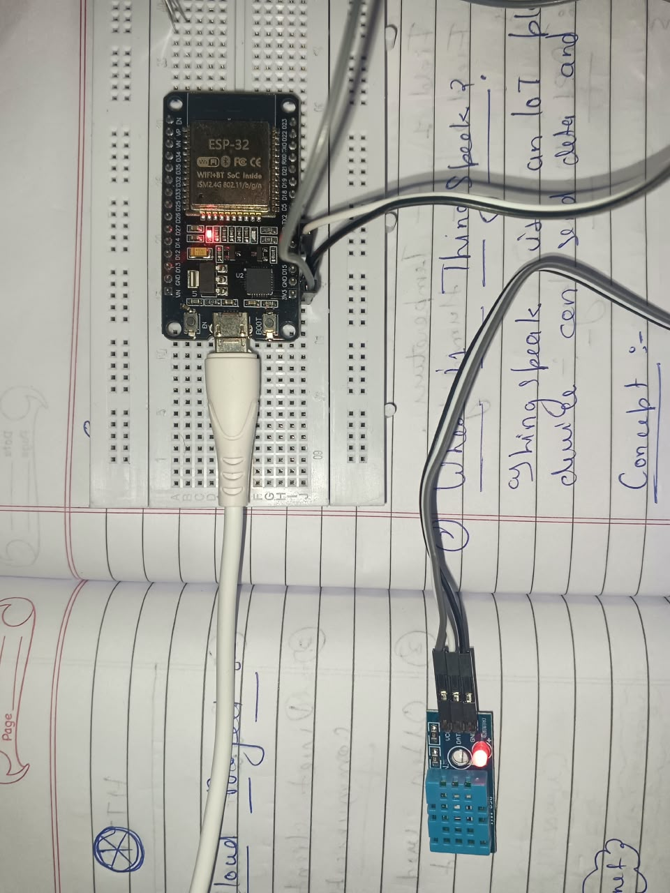
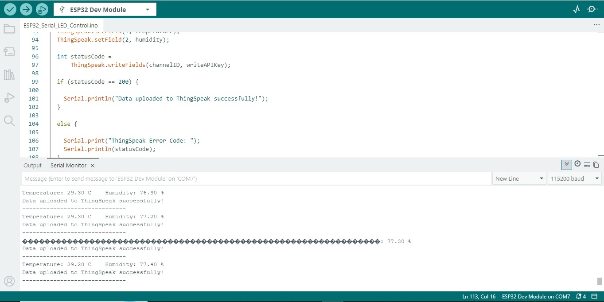
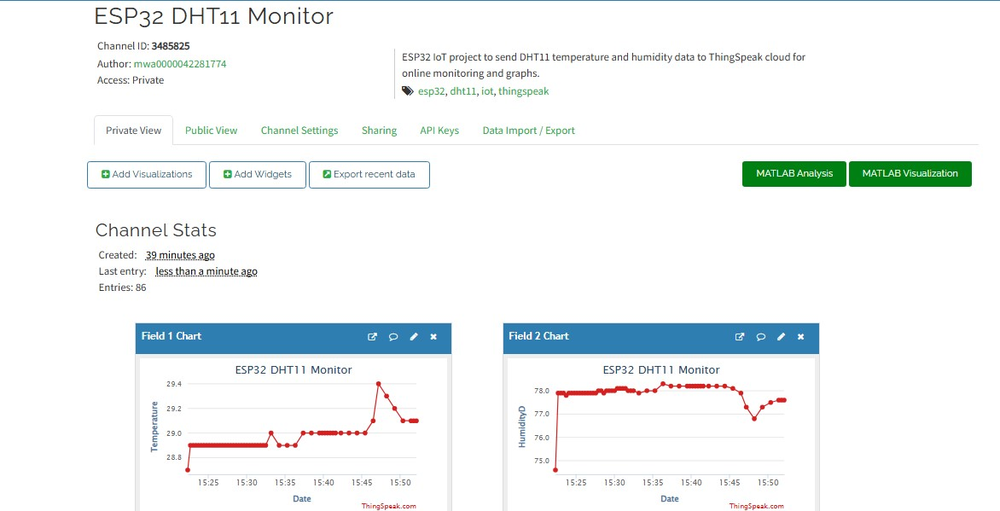

# ESP32 DHT11 ThingSpeak IoT 🌡️💧

A real-time IoT monitoring project using **ESP32**, **DHT11 sensor**, **Wi-Fi**, and **ThingSpeak Cloud**.

The ESP32 reads temperature and humidity from the DHT11 sensor and sends the data through the Internet to ThingSpeak, where it is displayed as live graphs.

---

## 🚀 Project Overview

This project demonstrates a complete IoT data flow:

```text
DHT11 Sensor
     ↓
ESP32
     ↓
Wi-Fi
     ↓
Internet
     ↓
ThingSpeak Cloud
     ↓
Live Temperature & Humidity Graphs
     ↓
Phone / Computer
```

---

## ✨ Features

- Real-time temperature monitoring
- Real-time humidity monitoring
- ESP32 Wi-Fi connectivity
- Cloud data upload
- ThingSpeak live visualization
- Automatic data updates
- Serial Monitor output
- Wi-Fi reconnection support
- DHT11 error detection

---

## 🧰 Components Required

| Component | Quantity |
|---|---:|
| ESP32 Development Board | 1 |
| DHT11 Temperature & Humidity Module | 1 |
| Jumper Wires | 3 |
| Breadboard | 1 |
| USB Data Cable | 1 |
| Wi-Fi / Mobile Hotspot | 1 |

---

## 🔌 DHT11 Connection

The DHT11 module used in this project has three pins:

| DHT11 | ESP32 |
|---|---|
| VCC | 3.3V |
| DATA | GPIO 4 |
| GND | GND |

### Connection Diagram

```text
DHT11                 ESP32

VCC   --------------> 3.3V

DATA  --------------> GPIO 4

GND   --------------> GND
```

---

## 📷 Hardware Setup



---

## ☁️ ThingSpeak Channel Setup

Create a new ThingSpeak channel with:

```text
Channel Name:
ESP32 DHT11 Monitor

Field 1:
Temperature

Field 2:
Humidity
```

Then open:

```text
API Keys
```

and copy your:

```text
Write API Key
```

You will also need your:

```text
Channel ID
```

---

## 📚 Libraries Required

Install the following libraries from Arduino IDE Library Manager:

### DHT Sensor Library

```text
DHT sensor library by Adafruit
```

### ThingSpeak Library

```text
ThingSpeak by MathWorks
```

The ESP32 Wi-Fi library is included with the ESP32 board package.

---

## 💻 Arduino Code

```cpp
#include <WiFi.h>
#include <ThingSpeak.h>
#include <DHT.h>

// ---------------- DHT11 ----------------

#define DHTPIN 4
#define DHTTYPE DHT11

DHT dht(DHTPIN, DHTTYPE);

// ---------------- Wi-Fi ----------------

const char* ssid = "YOUR_WIFI_NAME";
const char* password = "YOUR_WIFI_PASSWORD";

// ---------------- ThingSpeak ----------------

unsigned long channelID = YOUR_CHANNEL_ID;

const char* writeAPIKey = "YOUR_WRITE_API_KEY";

WiFiClient client;

void setup() {

  Serial.begin(115200);

  dht.begin();

  WiFi.mode(WIFI_STA);

  WiFi.begin(ssid, password);

  Serial.println("Connecting to Wi-Fi...");

  while (WiFi.status() != WL_CONNECTED) {

    delay(500);

    Serial.print(".");
  }

  Serial.println();

  Serial.println("Wi-Fi Connected!");

  Serial.print("IP Address: ");

  Serial.println(WiFi.localIP());

  ThingSpeak.begin(client);
}

void loop() {

  // Check Wi-Fi connection

  if (WiFi.status() != WL_CONNECTED) {

    Serial.println("Wi-Fi disconnected. Reconnecting...");

    WiFi.begin(ssid, password);

    while (WiFi.status() != WL_CONNECTED) {

      delay(500);

      Serial.print(".");
    }

    Serial.println();

    Serial.println("Wi-Fi Connected Again!");
  }

  // Read DHT11

  float humidity = dht.readHumidity();

  float temperature = dht.readTemperature();

  // Check sensor reading

  if (isnan(humidity) || isnan(temperature)) {

    Serial.println("Failed to read DHT11!");

    delay(2000);

    return;
  }

  Serial.print("Temperature: ");

  Serial.print(temperature);

  Serial.print(" C");

  Serial.print("    Humidity: ");

  Serial.print(humidity);

  Serial.println(" %");

  // Send values to ThingSpeak

  ThingSpeak.setField(1, temperature);

  ThingSpeak.setField(2, humidity);

  int statusCode =
      ThingSpeak.writeFields(channelID, writeAPIKey);

  if (statusCode == 200) {

    Serial.println(
      "Data uploaded to ThingSpeak successfully!"
    );
  }

  else {

    Serial.print("ThingSpeak Error Code: ");

    Serial.println(statusCode);
  }

  Serial.println("------------------------------");

  delay(20000);
}
```

---

## 🖥️ Serial Monitor Output

Set Arduino Serial Monitor to:

```text
115200 baud
```

Typical output:

```text
Connecting to Wi-Fi...
....
Wi-Fi Connected!

Temperature: 28.90 C    Humidity: 78.00 %
Data uploaded to ThingSpeak successfully!

Temperature: 28.90 C    Humidity: 78.00 %
Data uploaded to ThingSpeak successfully!
```

### Actual Serial Monitor Output



---

## 📊 ThingSpeak Cloud Visualization

Temperature is stored in:

```text
Field 1
```

Humidity is stored in:

```text
Field 2
```

ThingSpeak automatically creates graphs from the uploaded sensor data.

### Live Cloud Graph



---

## ⚙️ How It Works

### 1. DHT11 reads environmental data

The ESP32 reads:

```cpp
dht.readTemperature();
```

and:

```cpp
dht.readHumidity();
```

---

### 2. ESP32 connects to Wi-Fi

```cpp
WiFi.begin(ssid, password);
```

This connects the ESP32 to the Internet.

---

### 3. Temperature is assigned to Field 1

```cpp
ThingSpeak.setField(1, temperature);
```

---

### 4. Humidity is assigned to Field 2

```cpp
ThingSpeak.setField(2, humidity);
```

---

### 5. Data is uploaded to ThingSpeak

```cpp
ThingSpeak.writeFields(channelID, writeAPIKey);
```

---

### 6. ThingSpeak displays the data

The uploaded values are stored in the cloud and displayed as temperature and humidity graphs.

---

## ✅ Successful Upload

A successful ThingSpeak update returns:

```text
HTTP Status Code: 200
```

The program then displays:

```text
Data uploaded to ThingSpeak successfully!
```

---

## 🧠 Concepts Learned

Through this project I learned:

- Internet of Things (IoT)
- ESP32 programming
- DHT11 sensor interfacing
- Temperature measurement
- Humidity measurement
- Wi-Fi communication
- Cloud communication
- ThingSpeak IoT platform
- API Keys
- Channel ID
- Cloud data logging
- Live data visualization
- Serial communication
- Error handling
- Wi-Fi reconnection
- Embedded C/C++

---

## 🛠️ Software Used

- Arduino IDE
- ThingSpeak
- GitHub
- Arduino Serial Monitor

---

## 📂 Project Structure

```text
ESP32-DHT11-ThingSpeak-IoT/
│
├── ESP32_DHT11_ThingSpeak.ino
├── Project-Setup.jpeg
├── Serial-monitor.jpeg
├── ThingSpeak-Graph.jpeg
└── README.md
```

---

## ▶️ How to Run

1. Connect DHT11 to ESP32.

2. Install the required Arduino libraries.

3. Create a ThingSpeak channel.

4. Configure:

```text
Field 1 = Temperature
Field 2 = Humidity
```

5. Copy your Channel ID.

6. Copy your Write API Key.

7. Update the following values in the Arduino code:

```cpp
const char* ssid = "YOUR_WIFI_NAME";

const char* password = "YOUR_WIFI_PASSWORD";

unsigned long channelID = YOUR_CHANNEL_ID;

const char* writeAPIKey = "YOUR_WRITE_API_KEY";
```

8. Connect ESP32 to the computer.

9. Select:

```text
Board:
ESP32 Dev Module
```

10. Select the correct COM port.

11. Upload the program.

12. Open Serial Monitor at:

```text
115200 baud
```

13. Open your ThingSpeak channel.

14. Watch temperature and humidity values update on the cloud graphs.

---

## 🔮 Future Improvements

This project can be extended with:

- DHT22 sensor
- OLED display
- LCD display
- Temperature warning system
- Buzzer alarm
- Multiple environmental sensors
- Mobile dashboard
- Email alerts
- Remote monitoring
- Home automation
- Weather station
- Data analysis
- MATLAB visualization

---

## 🎯 Project Purpose

The main goal of this project is to understand how real sensor data travels from a physical device to an Internet cloud platform.

```text
Physical Sensor
      ↓
Microcontroller
      ↓
Network
      ↓
Internet
      ↓
Cloud
      ↓
Visualization
```

This is one of the fundamental concepts behind modern **Internet of Things systems**.

---

## 👨‍💻 Author

**Rajneesh Yadav**

Learning and building projects in:

- Embedded Systems
- ESP32
- IoT
- Arduino
- Sensors
- Electronics
- Microcontroller Programming
- Cloud Monitoring

---

## ⭐ Support

If you found this project useful, consider giving this repository a **Star ⭐**.

More ESP32, Embedded Systems and IoT projects coming soon.
